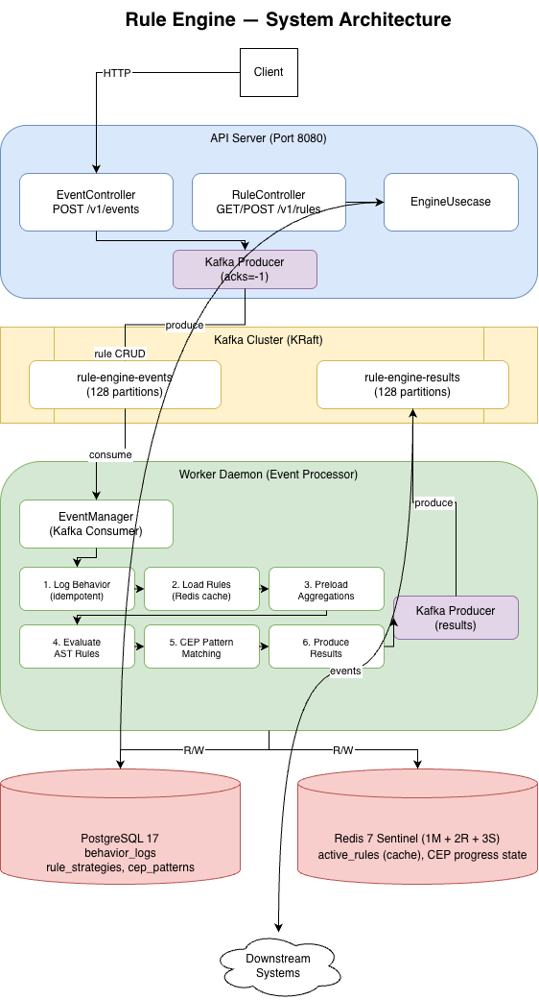

# rule-engine

A real-time behavioral risk control system built in Go, combining AST-based rule evaluation with Complex Event Processing (CEP) for detecting fraud patterns across event streams.

## System Architecture

Events flow through a **producer-consumer pipeline**: the API server validates and produces events to Kafka, while the Worker daemon consumes and runs them through a 6-step evaluation pipeline — logging, rule loading, aggregation preloading, AST evaluation, CEP pattern matching, and result production.

## Why This Design

**Why AST trees instead of hardcoded rules?**
Business rules change constantly. An AST representation (`AND`/`OR`/`NOT` trees with condition leaves) lets risk analysts compose arbitrary logic — "amount > 50,000 AND withdrawal count in 24h > 3" — without code changes. Rules are stored as JSON in PostgreSQL and hot-reloaded via a Redis cache with 60s TTL.

**Why separate Rule Engine and CEP?**
Single-event rules (thresholds, frequency limits) and multi-event sequences (behavioral chains) have fundamentally different state models. Combining them into one system would force stateful tracking onto simple threshold checks. Instead:

| | Rule Strategy | CEP Pattern |
|---|---|---|
| Trigger | Single event + historical aggregation | Multiple events in sequence |
| State | Stateless — queries DB per evaluation | Stateful — progress tracked in Redis |
| Use case | "Amount > 100K in 24h" | "Deposit → transfer to new address within 1h" |

**Why Kafka instead of synchronous processing?**
Decoupling ingestion from evaluation means the API server never blocks on rule computation. Partitioning by `member_id` guarantees per-user event ordering — critical for CEP pattern matching where sequence matters. With `acks=-1` and manual consumer commits, we get at-least-once delivery; idempotent writes via unique `event_id` constraints prevent duplicate processing.

**Why Redis Sentinel instead of standalone Redis?**
CEP progress state lives in Redis. If Redis goes down mid-pattern, all in-progress pattern matches are lost. Sentinel (1 master + 2 replicas + 3 sentinels) provides automatic failover, and AOF persistence ensures state survives restarts.

## Key Design Decisions

### Preloaded Aggregation Queries
The naive approach evaluates each rule independently, issuing N database queries for N rules. Instead, the worker **collects all aggregation keys** (e.g., `SUM(amount) WHERE behavior=Trade AND window=24h`) across all active rules before evaluation, executes them in a single batch, and injects results into a shared `EvalContext`. This turns O(N) DB round-trips into O(1).

### CEP Variable Binding
Pattern states can capture values (`$event.source_address`) and later states can reference them (`value: "$deposit_source"`). This enables cross-event correlation — detecting when a user deposits from address A but withdraws to address B — without custom code per pattern.

### Idempotent Event Processing
Kafka's at-least-once delivery means duplicate messages are possible. Rather than implementing exactly-once (which adds significant complexity and latency), behavior logs use a unique constraint on `event_id`. Duplicate inserts are silently ignored, keeping the pipeline simple and fast.

## Infrastructure

| Component | Role | Why This Choice |
|---|---|---|
| PostgreSQL 17 | Behavior logs, rule definitions, CEP patterns | JSONB for flexible rule AST storage; window-based aggregation queries |
| Redis 7 Sentinel | Rule cache (60s TTL), CEP progress state | Sub-ms reads for hot-path rule loading; Sentinel for HA |
| Kafka (KRaft) | Event streaming, 128 partitions | Ordered per-member processing; decoupled ingestion from evaluation |

## Benchmark

Measured on Apple M2 Pro:

| Scenario | Avg Latency | What It Measures |
|---|---|---|
| 6 rules, no I/O | ~9 us | Pure AST evaluation speed |
| 300 rules, no I/O | ~194 us | Rule engine scaling behavior (~0.65 us/rule) |
| 6 rules, real DB/Redis/Kafka | ~9 ms | End-to-end with infrastructure overhead |
| High aggregation workload | ~9.6 ms | Impact of complex window queries |

The ~9ms integration latency is dominated by database aggregation queries and Kafka produce latency, not rule evaluation itself. This confirms the preloaded aggregation optimization is working — without it, 6 rules with 2-3 aggregations each would issue 12-18 sequential DB queries instead of a batched set.

## Tech Stack

Go 1.24 / Gin / GORM / confluent-kafka-go / go-redis / Google Wire / PostgreSQL 17 / Redis 7 Sentinel / Kafka (KRaft) / Docker Compose